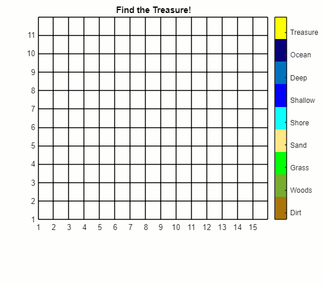

# Fundamentals of Programming

 or 

**Curriculum Module**

_Created with R2024a. Compatible with R2024a and later releases._

# Information

This curriculum module contains interactive [MATLAB® live scripts](https://www.mathworks.com/products/matlab/live-editor.html) that  teach fundamental concepts and basic terminology related to programming computers. This includes discussion of inputs and outputs, numbers, strings, arrays, branches and loops. This content is broken into six instructional live scripts and one project where live script instructions are paired with a plain code practice script. Solutions are available to instuctors upon request.

## Background

You can use these live scripts as demonstrations in lectures, class activities, or interactive assignments outside class. Fundamentals of Programming includes an introduction to programming which includes discussion of errors, documentation, and other commonly encountered challenges for beginners. Data introduces double and string data types. Arrays introduces 1, 2, and 3\-D arrays, as well as a brief overview of matrix operations. Applications include both text and image data. Branches introduces the concept of conditional branching in the form of if/else branches and switch statements. Loops introduces the concept of conditional looping in the form of for loops and while loops. Chaos Game Project provides a scaffolded approach to implementing the chaos game by combining skills from each of the other scripts. The final script, Algorithms, introduces algorithms, pseudocode, and testing. Additional files include the navigation file Main Menu and the Collected Pro Tips.

The instructions inside the live scripts will guide you through the exercises and activities. Get started with each live script by running it one section at a time. To stop running the script or a section midway (for example, when an animation is in progress), use the  Stop button in the **RUN** section of the **Live Editor** tab in the MATLAB Toolstrip.

## Contact Us

Solutions are available upon instructor request. Contact the [MathWorks teaching resources team](mailto:onlineteaching@mathworks.com) if you would like to request solutions, provide feedback, or if you have a question.

## Prerequisites

This module assumes familiarity with basic mathematics at a high school level. One exercise in Data.mlx requires the use of the quadratic formula, for instance. Understanding the chaos game requires locating points on a Cartesian coordinate system and understanding of either vectors or midpoints. Trigonometric functions are used as example functions. With respect to programming knowledge, this module is intended for absolute beginners who have used simple calculators in the past.

## Getting Started
### Accessing the Module
### **On MATLAB Online:**

Use the  link to download the module. You will be prompted to log in or create a MathWorks account. The project will be loaded, and you will see an app with several navigation options to get you started.

### **On Desktop:**

Download or clone this repository. Open MATLAB, navigate to the folder containing these scripts and double\-click on [FundamentalsofProgramming.prj](https://matlab.mathworks.com/open/github/v1?repo=MathWorks-Teaching-Resources/Fundamentals-of-Programming&project=FundamentalsofProgramming.prj&file=README.mlx). It will add the appropriate files to your MATLAB path and open an app that asks you where you would like to start. 

Ensure you have all the required products (listed below) installed. If you need to include a product, add it using the Add\-On Explorer. To install an add\-on, go to the **Home** tab and select   **Add-Ons** > **Get Add-Ons**. 

## Products

MATLAB® is used throughout. Image Processing Toolbox™ is used for <samp>imsplit</samp> in <samp>Arrays.mlx</samp>.

# Scripts
## [**Introduction.mlx**](https://matlab.mathworks.com/open/github/v1?repo=MathWorks-Teaching-Resources/Fundamentals-of-Programming&project=FundamentalsofProgramming.prj&file=https://matlab.mathworks.com/open/github/v1?repo=MathWorks-Teaching-Resources/Fundamentals-of-Programming&project=FundamentalsofProgramming.prj&file=Scripts/Introduction.mlx) 
|      |      |
| :-- | :-- |
|  | **In this script, students will...**     |
|     | $\bullet$ recognize and use the terms input and output.   $\bullet$ recognize, interpret, and respond to messages about syntax errors.   $\bullet$ recognize and interpret comments in code.   $\bullet$ use documentation and search to learn more about how to use a programming language.   $\bullet$ recognize and explain the importance of attention to detail when coding.     |
|      |       |

## [**Data.mlx**](https://matlab.mathworks.com/open/github/v1?repo=MathWorks-Teaching-Resources/Fundamentals-of-Programming&project=FundamentalsofProgramming.prj&file=https://matlab.mathworks.com/open/github/v1?repo=MathWorks-Teaching-Resources/Fundamentals-of-Programming&project=FundamentalsofProgramming.prj&file=Scripts/Data.mlx) 
|      |      |
| :-- | :-- |
|  | **In this script, students will...**     |
|     | $\bullet$ recognize and explain that floating point arithmetic does not operate under the same rules as real number arithmetic.   $\bullet$ apply the limitations of floating point arithmetic to computation.   $\bullet$ recognize and use strings to store and communicate textual data.   $\bullet$ recognize and use whitespace in string operations.   $\bullet$ recognize and interpret special characters that are neither text nor numbers.   $\bullet$ recognize and explain simple consequences of the interactions between data types.     |
|      |       |

## [**Arrays.mlx**](https://matlab.mathworks.com/open/github/v1?repo=MathWorks-Teaching-Resources/Fundamentals-of-Programming&project=FundamentalsofProgramming.prj&file=https://matlab.mathworks.com/open/github/v1?repo=MathWorks-Teaching-Resources/Fundamentals-of-Programming&project=FundamentalsofProgramming.prj&file=Scripts/Arrays.mlx) 
|      |      |
| :-- | :-- |
|  | **In this script, students will...**     |
|     | $\bullet$ identify, create, and use vectors and matrices containing numbers or text.   $\bullet$ use vector indexing to extract information from a vector or matrix.   $\bullet$ identify standard file types and the corresponding extensions.   $\bullet$ explain why file type matters and import data from external files.   $\bullet$ recognize and use three dimensional arrays.     |
|      |       |

## [**Branches.mlx**](https://matlab.mathworks.com/open/github/v1?repo=MathWorks-Teaching-Resources/Fundamentals-of-Programming&project=FundamentalsofProgramming.prj&file=https://matlab.mathworks.com/open/github/v1?repo=MathWorks-Teaching-Resources/Fundamentals-of-Programming&project=FundamentalsofProgramming.prj&file=Scripts/Branches.mlx) 
|      |      |
| :-- | :-- |
|  | **In this script, students will...**     |
|     | $\bullet$ recognize and apply if/then branching logic to solve problems.   $\bullet$ recognize and apply switch branching logic to solve problems.     |
|      |       |

## [**Loops.mlx**](https://matlab.mathworks.com/open/github/v1?repo=MathWorks-Teaching-Resources/Fundamentals-of-Programming&project=FundamentalsofProgramming.prj&file=https://matlab.mathworks.com/open/github/v1?repo=MathWorks-Teaching-Resources/Fundamentals-of-Programming&project=FundamentalsofProgramming.prj&file=Scripts/Loops.mlx) 
|      |      |
| :-- | :-- |
|  | **In this script, students will...**     |
|     | $\bullet$ use for loop logic and syntax to write and execute iterative code.   $\bullet$ use while loop logic and syntax to write and execute repetitive code, and decide when it is the correct method.     |
|      |       |

## [**Chaos Game Project**](https://matlab.mathworks.com/open/github/v1?repo=MathWorks-Teaching-Resources/Fundamentals-of-Programming&project=FundamentalsofProgramming.prj&file=https://matlab.mathworks.com/open/github/v1?repo=MathWorks-Teaching-Resources/Fundamentals-of-Programming&project=FundamentalsofProgramming.prj&file=https://matlab.mathworks.com/open/github/v1?repo=MathWorks-Teaching-Resources/Fundamentals-of-Programming&project=FundamentalsofProgramming.prj&file=Scripts/ChaosGameProject.mlx) 
|      |      |
| :-- | :-- |
|  | **In this script, students will...**     |
|      | $\bullet$ apply conditional branching and looping logic in context to solve problems.   $\bullet$ explain that different programming solutions to the same problem can run in very different amounts of time.   $\bullet$ identify common file formats and their extensions.   $\bullet$ communicate results by exporting data from a program in a standard, shareable file format.     |
|      |       |

## [**Algorithms.mlx**](https://matlab.mathworks.com/open/github/v1?repo=MathWorks-Teaching-Resources/Fundamentals-of-Programming&project=FundamentalsofProgramming.prj&file=https://matlab.mathworks.com/open/github/v1?repo=MathWorks-Teaching-Resources/Fundamentals-of-Programming&project=FundamentalsofProgramming.prj&file=Scripts/Algorithms.mlx) 
|      |      |
| :-- | :-- |
|  | **In this script, students will...**     |
|     | $\bullet$ explain the concept of an algorithm.   $\bullet$ implement an algorithm presented in pseudocode.   $\bullet$ explain the importance of testing both code and algorithms.     |
|      |       |

# Additional Scripts

[Main Menu](./MainMenu.mlx) \- Just the link sections of this script for navigation

[Collected Pro Tips](https://matlab.mathworks.com/open/github/v1?repo=MathWorks-Teaching-Resources/Fundamentals-of-Programming&project=FundamentalsofProgramming.prj&file=Scripts/CollectedProTips.mlx) \- Notes on how to implement particular concepts in MATLAB

# License

The license for this module is available in the [LICENSE.md](https://github.com/MathWorks-Teaching-Resources/Fundamentals-of-Programming/blob/release/LICENSE.md).

# Related Courseware Modules
|      |      |      |
| :-- | :-- | :-- |
| **Courseware Module**    | **Sample Content**    | **Available on:**     |
| [**Treasure Hunt Game: Learn to Code**](https://www.mathworks.com/matlabcentral/fileexchange/123265-treasure-hunt)   Build and customize an interactive searching game    |     |       [GitHub](https://github.com/MathWorks-Teaching-Resources/Treasure-Hunt)     |
| [**Programming: Structuring Code**](https://www.mathworks.com/matlabcentral/fileexchange/115905-programming-structuring-code)   Learn how to organize your code into functions,    debug, comment, and share    |     |       [GitHub](https://github.com/MathWorks-Teaching-Resources/Programming-Structuring-Code)     |
| [**Programming: Organizing Data**](https://www.mathworks.com/matlabcentral/fileexchange/115900-programming-organizing-data)   Learn more about strings, numeric data types,    memory, and ways of storing data    |     |       [GitHub](https://github.com/MathWorks-Teaching-Resources/Programming-Organizing-Data)     |
| [**Programming: A Starter Project Using MATLAB and Python**](https://www.mathworks.com/matlabcentral/fileexchange/116490-programming-a-starter-project-using-matlab-and-python)   Use MATLAB, Python, and the OpenWeather API    together to implement a weather prediction dashboard    |     |       [GitHub](https://github.com/MathWorks-Teaching-Resources/Programming-A-Starter-Project-Using-MATLAB-and-Python)     |
|      |      |       |

Or feel free to explore our other [modular courseware content](https://www.mathworks.com/matlabcentral/fileexchange/?q=tag%3A%22courseware+module%22&sort=downloads_desc_30d).

# Educator Resources
-  [Educator Page](https://www.mathworks.com/academia/educators.html) 

# How to Contribute 

Looking for more? Find an issue? Have a suggestion? Please contact the [MathWorks teaching resources team](mailto:%20onlineteaching@mathworks.com). If you want to contribute directly to this project, you can find information about how to do so in the [CONTRIBUTING.md](https://github.com/MathWorks-Teaching-Resources/Fundamentals-of-Programming/blob/release/CONTRIBUTING.md) page on GitHub.

 *©* Copyright 2023 The MathWorks™, Inc

